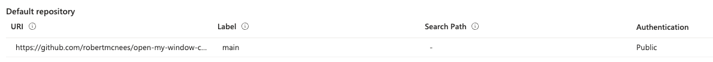
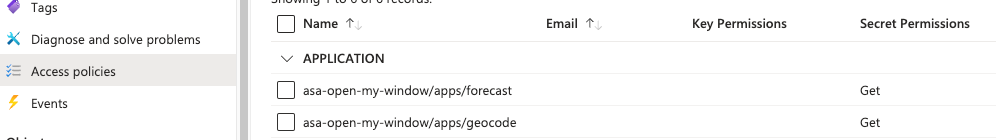
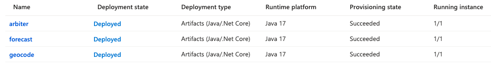

# Overview

This document is meant to give an overview and a brief description of the application components that are specific to deploying on Azure Spring Apps basic tier.

The applications `discoveryserver` and `configserver` are not required when running on Azure Spring Apps basic tier offering.  This functionality is provided out of the box from Microsoft and our Spring apps will be be able to automatically use a service discovery and centralized configuration with no external configuration required.

# Service Communication

As stated by [Azure Documentation](https://docs.microsoft.com/en-us/azure/spring-cloud/how-to-service-registration?pivots=programming-language-java) regarding service registration and discovery, Azure Spring Apps provides 2 methods to allow your services to communicate.  For demonstration purposes, open-my-window uses both.  *arbiter -> geocode* will use the kubernetes service and *arbiter -> forecast* will use Spring Cloud service discovery.

## Azure Spring Apps - Native Kubernetes Service

Kubernetes service names are created automatically

``
Azure Spring Apps creates a corresponding kubernetes service for every app running in it using app name as the kubernetes service name. So you can invoke calls in one app to another app by using app name in a http/https request like http(s)://{app name}/path.
``

The `GeocodeService` class in `arbiter` uses this approach to communicate with `geocode`.  Since this is using a native kubernetes service under the hood, it will look very similar to a native kubernetes solution.

In the example below when running in Azure Spring Apps **no variable `geocodeserviceurl` will be provided so the URL will default to `geocode`** which is the application name that we wish to call.
.
```java
	@Value("${geocodeserviceurl:geocode}")
	private String geocodeServiceUrl;
```

```java
	public GeocodeCoordinates getGeocodeCoordinates(String postalCode, String countryCode) {
		return restTemplate.getForObject("http://" + geocodeServiceUrl + "/geocode/coordinates?postalCode=" + postalCode + "&countryCode=" + countryCode,
				GeocodeCoordinates.class);
	}
```

## Azure Spring Apps - Spring Cloud Service Registration

Use Spring Cloud Service Registration

The `ForecastService` class in `arbiter` will use the instance of `forecast` registered with the service registration.  A `DiscoveryClient` is injected into the constructor of this class to find the instance.

```java
	public ForecastService(RestTemplateBuilder restTemplateBuilder, DiscoveryClient discoveryClient) {
		this.restTemplate = restTemplateBuilder.build();
		this.discoveryClient = discoveryClient;
	}

	public ForecastRecord getCurrentWeather(Double lat, Double lon) {
		ServiceInstance serviceInstance = discoveryClient.getInstances("forecast").get(0);
		return restTemplate.getForObject("http://" + serviceInstance.getUri().getHost() + ":" + serviceInstance.getUri().getPort()
				+ "/forecast/forecastWeather?lat="+lat+"&lon="+lon, ForecastRecord.class);
	}
```

# External Configuration

Azure Spring Apps will automatically [connect to a managed Spring Cloud Config Server](https://learn.microsoft.com/en-us/azure/spring-apps/how-to-config-server#attach-your-config-server-repository-to-azure-spring-apps).

For testing purposes there is a value in `ArbiterController.java` in the `arbiter` module that attempts to find a value from external configuration.

```
@Value("${COMFORTABLE_TEMPERATURE:298}")
private String COMFORTABLE_TEMP;
```

This value is accessible through the test endpoint `/window/comfortableTemp`.

## Azure Spring Apps Config Server

An external GitHub repository can be configured to use for external configuration.  For the purposes of this application [a public GitHub repository](https://github.com/robertmcnees/open-my-window-config) is used to configure the `COMFORTABLE_TEMPERATURE` variable.



# Deployment

## Create Applications in Azure Spring Apps

In order to deploy an application to Azure Spring Apps we must first create the application before we deploy.  Note that this only creates the placeholder that we will deploy to later and does not deploy any code.  The CLI is used below but this can also be done via the portal.  The service name in the documentation below is `asa-open-my-window` and can be replaced with a different service name if needed.

First execute the one time command `az login` and then [create each application](https://learn.microsoft.com/en-us/cli/azure/spring/app?view=azure-cli-latest#az-spring-app-create%28spring%29) individually:

```
az spring app create --service asa-open-my-window --runtime-version Java_17  --name geocode

az spring app create --service asa-open-my-window --runtime-version Java_17  --name forecast

az spring app create --service asa-open-my-window --runtime-version Java_17 --assign-endpoint true --name arbiter
```

## Secret Management

open-my-window uses the secret `OPENWEATHERAPIKEY` to communicate with the Open Weather API.  If an application requires access to a secret from Key Vault (geocode, forecast) this must be configured before the app is deployed.

### Microsoft Azure Key Vault Configuration
open-my-window uses Azure Key Vault for secret management.  Access to the Key Vault is granted through the ID of the individual applications.  The following commands can be run to assign and show the appropriate identity.

```
az spring app identity assign --name geocode --service asa-open-my-window   

az spring app show --name geocode --service asa-open-my-window | jq -r '.identity.principalId'
```

The application identity can be added through the 'Access policies' section of the Key vault.  This can be done from the [Azure portal or the CLI](https://learn.microsoft.com/en-us/azure/key-vault/general/assign-access-policy).  This must be done for every deployed application in the environment that needs access to the Key Vault (geocode, forecast).  An example CLI command is: 

```
az keyvault set-policy --name <key_vault> --resource-group <key_vault_resource_group> --object-id <app_identity> --secret-permissions get
```



## Deploy Applications with CLI

The command below can now be used to deploy a built .jar file to Azure Spring Apps.

```
az spring app deploy --name forecast --artifact-path ./target/forecast-0.0.1-SNAPSHOT.jar --jvm-options="-Xms2048m -Xmx2048m"
```

## Deploy Applications with GitHub Actions

Deployment scripts are provided for the basic tier of Azure Spring Apps.  These deployment workflows start with the prefix of 'asa-basic-tier'.  They all make use of the [spring-apps-deploy](https://github.com/Azure/spring-apps-deploy) GitHub plugin.

The deployment workflows depend on several GitHub repository secrets to be configured:

```
ASA_SERVICE_INSTANCE_NAME
AZURE_CREDENTIALS
AZURE_SUBSCRIPTION_ID
AZURE_SUBSCRIPTON_NAME
RESOURCE_GROUP
```
Upon completion all 3 applications should be visible in the `Apps` section of Azure Spring Apps.

